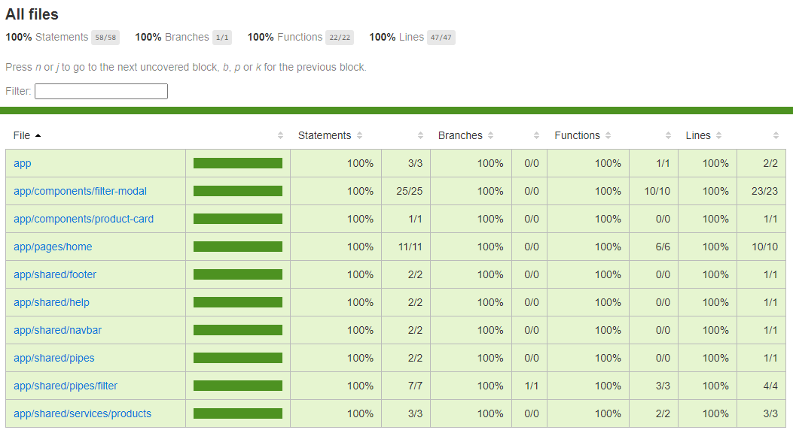

# Prueba Técnica DDB Angular

En este repositorio se encuentra el desarrollo de la prueba Técnica para la empresa DDB

## Cobertura de pruebas unitarias
Se realizaron pruebas unitarias de los componentes más esenciales



## Maquetación

Resultado de la maquetación


## Development server

Run `ng serve` for a dev server. Navigate to `http://localhost:4200/`. The application will automatically reload if you change any of the source files.
```sh
ng serve
```

## Build

Run `ng build` to build the project. The build artifacts will be stored in the `dist/` directory.
```sh
ng build
```

## Running unit tests

Run `ng test` to execute the unit tests via [Karma](https://karma-runner.github.io).

```sh
ng test
```
